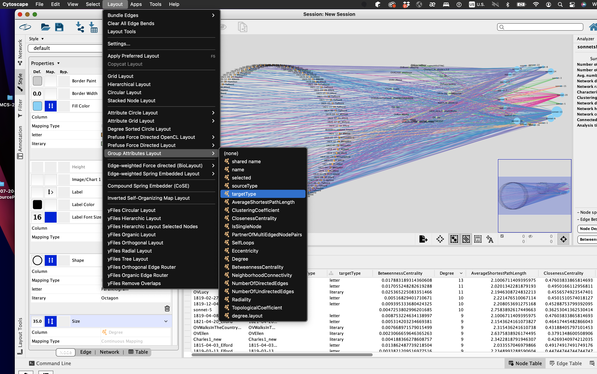
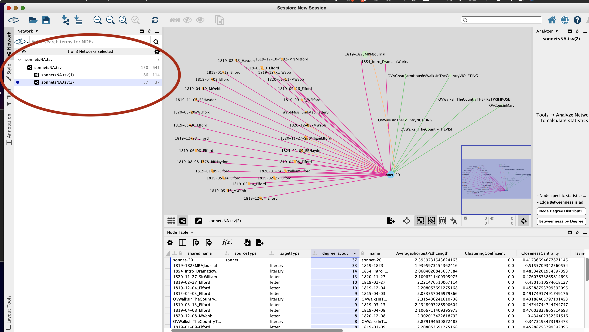

# Part II: Exploring Cytoscape
## A visual step-by-step guide, starting from a TSV file with node,s, edges, and descriptive data

In the previous tutorial we worked from an XML (TEI) based digital edition to pull network data using XQuery. 
We have [a text file formatted as a TSV](network/sonnetsNA.tsv) for output that we are working with. 

Now we turn our attention to exploring and processing the network data

## Import and explore network statistics 

### 1. Import a table file to Cytoscape 

### 2. Carefully set up the Cytoscape import options: 
Usually (as is the case with our example), our first line from an XQuery pull to a TSV text file is data, not a header. Be sure to **un-select** the box that wants to use the first line as column names. 

### 3. Mark each column of the table import with network source, edge, target info.

Here we are marking the following. 
* **Source Node**
* **Source Attribute** (descriptor which we'll use for styling)
* **Edge (connector** or intersection between our source and target nodes)
* **Edge Attribute** (descriptor which we'll use for styling)
* **Target Node**
* **Target Attribute** (descriptor which we'll use for styling)
*Note: The **attribute** descriptors are not required but we find them very helpful for styling based on the rich contextual information an XML-based digital edition tends to store.*

### 4. Admire or gasp in horror at your network viz on import.

* Notice the table view of the data has "collapsed" the source and target nodes. We'll be working more with this table view.
Explore the different ways to view it: Node table, Edge table, Network table. 

* On the left is a styling pane that we will also be exploring. 

### 5. Run the "Analyze Network" to calculate network statistics.

### 6. Decide whether your graph is directed or not.

This is a very important decision: Are the network relationships you are plotting meant to express cause-and-effect or direct influence of one node on another? 
You may want your source nodes to be understood as initiating relationships and the target nodes as receiving something from the source nodes.
If this is the kind of relationship you're trying to describe, mark the **directed** option.
not, you may be exploring a network of *co-occurence*, in which you simply want to express that certain phenomena (source and target nodes) show up together in the same context. 
That would be an **undirected** graph: don't mark the box!

*Note: A directed graph will make edges become arrows that run from source nodes to point to their target nodes. 

### 7. Explore the Cytoscape network table with its calculated network statistics data.

Network concepts and statistics that you may wish to explore with your data:
* **Degree**
* **Betweenness Centrality**
* **Average Shortest Path Length**

### 8. Reorganize the network table to prioritize and sort the information you care about.

* Click and drag the columns around.
* Double-click on a header row to sort a column

## Styling a Network with Cytoscape
This does not aim to be a complete tutorial, but rather an introductory orientation to help you start exploring.

### Node Styling
Look for the small tabs along the bottom of the Styling Pane, and select the Node tab.

#### 9. Orientation to the Node Styling Pane. 
You must select the box for “Lock node width and height” in order to change the sizes of nodes, make them reflect network statistics such as degree or betweenness centrality.

#### 10. Changing node size? Try manipulating the scale with Continuous Mapping:

You can grab the “handle bars” to increase or decrease the slope for scaling the node size. Try it and see: 

#### 12. Applying color to differentiate the kinds of nodes.
Remember our attribute descriptors? This is precisely where they come in handy! 
Find the column heading that you set on import, and set it in the Styling pane for Fill Color (or wherever you wish). 
Select the option for **Discrete Mapping** to select one color for each category.

### Edge Styling 
Now, look for the small tabs along the bottom of the Styling Pane again, and select the Edge Tab just to the right of the Node Tab. 

#### 13. Find and study the Edge Table.

In our sample data, we imported edge attributes to categorize different kinds of connections. 
Perhaps we can color code some of the connection categories? 
Be careful of overwhelming with too much color. Perhaps some categories in our example can be sort of collapsed!
In our example, we'll be applying the same colors to any nodes that represent people. We'll use
color to distinguish major categories like people from places.

#### 14. Adding color to categorize the edges
This is much the same as what we did for color-coding nodes. 
Choose a the column from the Edge Table that represents the Edge Attribute information and apply Discrete Mapping to select one color for each category.

*Note: You can change the colors later. We'll get rid of the soft lavender here a little later in the tutorial to amplify the contrast.*

### Styling the entire network visualization
Once again, look for the small tabs along the bottom of the Styling Pane, and find Network tab (to the right of the Edge tab).

#### 15. Change the background color for the Network Analysis if you wish:

*Note: Cytoscape also has its own color themes for networks. Ordinarily we bypass these because color coding our infographics might be highly customized for a project.

#### 16. Changing the layout of the network
Now we use the **Layout menu** and begin exploring many different ways to organize your network in two-dimensional space. 

Take your time and explore to see what layouts help to organize your data in a way that is helpful.
Sometimes the layout gives you insights into relationships you're studying.

*Here we are trying the **Group Attributes Layout** and selecting a layout that matches our Target attributes, and found it helpful to organize quite a lot of relationships. It was helpful for us to pull the nodes representing letters away from the nodes representing literary documents simply to help study the various relationships.* 

#### 17. Manipulate the nodes “by hand” to make the network more legible.
You can always “pull out” and otherwise disentangle nodes to make them easier to see. 

*Note: You can also annotate the network viz. Try right-clicking in the space near to something you want to highlight, and find the text annotation fields and options. 

#### 18. Changing the scale of the network viz

Try the Layout Tools on the bottom left in the Styling Pane to alter the scale of the entire network graph.

### Creating Subnetworks from a large, complex network
One of the most helpful things to do with a large and complex network visualization is to create sub-networks to isolate particularly interesting nodes and their immediate neighbors. 

#### 19. Select a particular node and its adjacent edges

* First, select a node or a few nodes by clicking on them in the graph, or by selecting them on your Node table. 
* Then, use the Select menu, choose Edges, and on the submenu go to the bottom and choose, “Select Adjacent Edges”
* 

#### 20. Now, select the neighbors on the other side of the edge connections.

#### 21. Create a subnetwork from the selection.
Find the icon near the top center to create new network from the selection.

When prompted, choose to create the subnetwork only from the selected edges:

#### 22. Redo the layout for your new subnetwork.

The subnetwork will come out with all the nodes and edges in their position from the original network. You'll want to modify that, so you can return to the Layout menu and try out the options, or even redo the same layout, which will now be optimized for the smaller selection of nodes. 

#### 23. Moving between multiple subnetworks 
Don’t worry about losing the main network when you create a subnetwork. Cytoscape’s Network pane (in the Styling panel on the left) helps you to see the main network and any subnetworks you create in a nested hierarchy. 

Here are two more subnetworks we created to show how you can start a subnetwork from target nodes:

* a very tiny subnetwork between the headnote of a play and three sonnets 

* a subnetwork starting from a letter to show connected sonnets: 

## Exporting your visualizations from Cytoscape

You can export static SVG or PNG files that represent your network styling. These will not be interactive, but can readily be used as infographics in a web-based or print project. 

We prefer to output SVG for use in web-based digital edition projects. You could try opening the output SVG in a code editor to see how you might manipulate it. 

You can also explore the web outputs from Cytoscape, which do permit interaction. Here are two different web exports of our entire network, permitting visitors to tug on nodes and rearrange and explore them at will. 

* Simple Web View (only your styling): 

* Full Web View (your styling, plus lots of layout/theme options):

Of course you should also be saving your Cytoscape file session regularly. It will save with a `.cys` file extension.

## File Resources and Further Reading: 

* [Our Cytoscape session file complete with subnetworks](network/MRMsonnetsNetwork.cys)

* [An Introduction to Network Analysis and Cytoscape for XML Coders](http://ebeshero.github.io/thalaba/cytosc.html) My longer (and older) network analysis tutorial with more on the theory and history of networks. 
